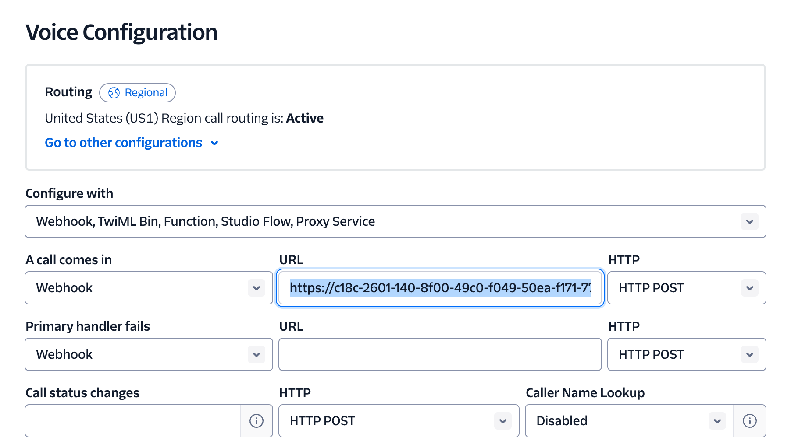
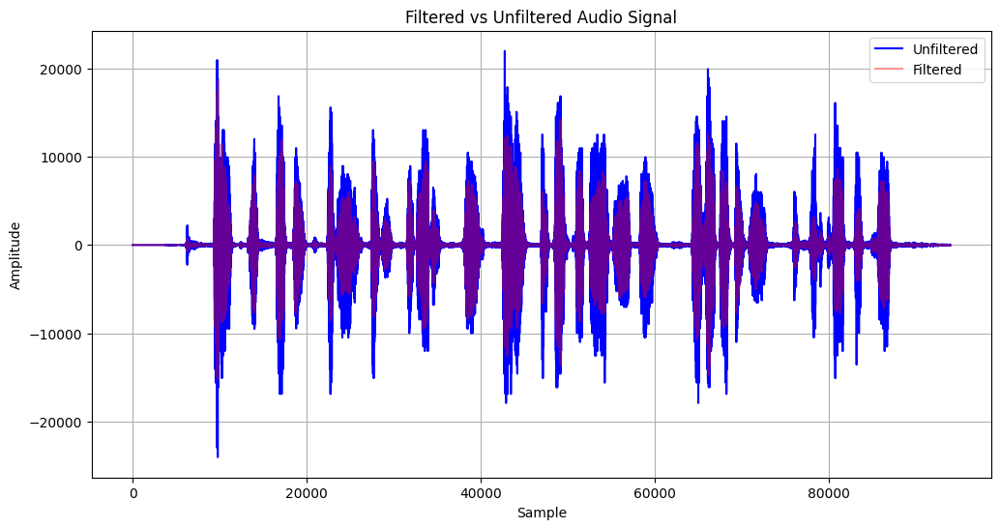
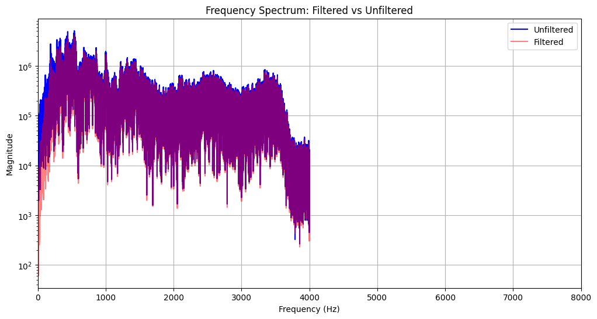

# Steps

## Create a Twilio Account

Create a Twilio account and purchase a new number.

## Choose your Filter
There is a `TODO` in the [`twilioSocket.ts`](./src/twilioSocket.ts) file with the filter options. Select which one you want from the list:

- highPassFilterAndSaveToWav
- bandPassFilterAndSaveToWav
- biquadBandPassFilterAndSaveToWav

## Run the Server

Use the VS Code "Run Server" task or the following command to run the server:

```bash
npm run dev
```

This will print out an ngrok URL. Copy that.

## Paste the Ngrok URL into Twilio

In Twilio, navigate to your phone number and paste the ngrok URL into the URL field:



## Test it Out

You can use https://mynoise.net/ to generate background noise for testing. Once the noise generator is playing, call your Twilio number and say a few things. Hang up.

When the websocket disconnects, the server will create two files: `twilio_call_filtered.wav` and `twilio_call_unfiltered.wav`.

## Visualize the Filter

Open the `wav_visualizer.ipynb` notebook and run the code cell.

Example:




# Twilio Resources

## Start Payload

```
{
    event: 'start',
    sequenceNumber: '1',
    start: {
      accountSid: '1234',
      streamSid: 'MZ14f465fb39b99eb0b0efd4bd5456cc8d',
      callSid: '6789',
      tracks: [ 'inbound' ],
      mediaFormat: { encoding: 'audio/x-mulaw', sampleRate: 8000, channels: 1 },
      customParameters: { from: '+13152716606' }
    },
    streamSid: 'MZ14f465fb39b99eb0b0efd4bd5456cc8d'
}
```

## Media Payload
```
{
"event":"media",
"sequenceNumber":"3122",
"media":
  {
    "track":"inbound",
    "chunk":"3121",
    "timestamp":"62411",
    "payload":"////f39////////..."
  },
"streamSid":"MZe36496a19c2240a634016c64787ee984"
}
```